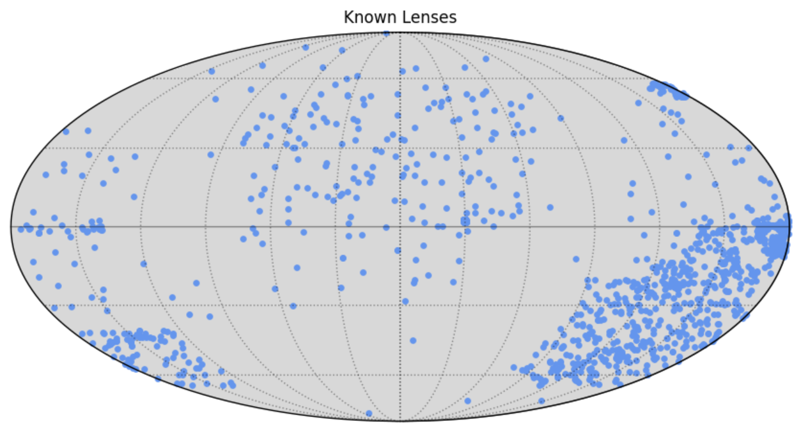

# $\texttt{lenscat}$

A public and community-maintained catalog of known strong gravitational lenses. 

Structure:

['Name'] = Names of galaxies/galaxy clusters \
['RA'] = RA in dergees \
['DEC'] = DEC in degrees \
['zlens'] = Lens redshift (if known) \
['type'] =  Type of lens (i.e. galaxy or galaxy cluster) \
['rank'] = Ranking whether it is a confirmed lens or a probable lens (see individual references for internal ranking systems).

This catalogue contains the known strong lenses from the following studies:

  - GLQ Database:
    https://research.ast.cam.ac.uk/lensedquasars/index.html

  - CLASH (Postman+2012):
    https://archive.stsci.edu/prepds/clash/

  - MUSES Cluster Followups (Richards+2020):
    https://cral-perso.univ-lyon1.fr/labo/perso/johan.richard/MUSE_data_release/

  - RELICS
    https://relics.stsci.edu/clusters.html

  - 37 Clusters from SDSS Giant Arcs Survey
    https://iopscience.iop.org/article/10.3847/1538-4365/ab5f13

  - An Extended Catalog of Galaxy–Galaxy Strong Gravitational Lenses Discovered in DES Using Convolutional Neural Networks
    https://iopscience.iop.org/article/10.3847/1538-4365/ab26b6#apjsab26b6t5

  - The AGEL Survey: Spectroscopic Confirmation of Strong Gravitational Lenses in the DES
    and DECaLS Fields Selected Using Convolutional Neural Networks
    https://arxiv.org/ftp/arxiv/papers/2205/2205.05307.pdf

  - LSD Survey
    https://web.physics.ucsb.edu/~tt/LSD/

  - (COSMOS) LensFlow: A Convolutional Neural Network in Search of Strong Gravitational Lenses
    https://ui.adsabs.harvard.edu/abs/2018ApJ...856...68P/abstract

ACTIVELY BEING ADDED:

  - The Sloan Lens ACS Survey. IX. Colors, Lensing, and Stellar Masses of Early-Type Galaxies
    https://ui.adsabs.harvard.edu/abs/2009ApJ...705.1099A/abstract

  - The SL2S Galaxy-scale Lens Sample. IV. The Dependence of the Total Mass Density Profile of Early-type Galaxies on Redshift, Stellar        Mass, and Size
    https://ui.adsabs.harvard.edu/abs/2013ApJ...777...98S/abstract
  - First Catalog of Strong Lens Candidates in the COSMOS Field
    https://iopscience.iop.org/article/10.1086/526426/pdf

  - Finding strong gravitational lenses in the Kilo Degree Survey with Convolutional Neural Networks
    https://ui.adsabs.harvard.edu/abs/2017MNRAS.472.1129P/abstract
    NOTE: This list does not have any information about the locations of the sources, which is very annoying. I will add these in manually at some point.

